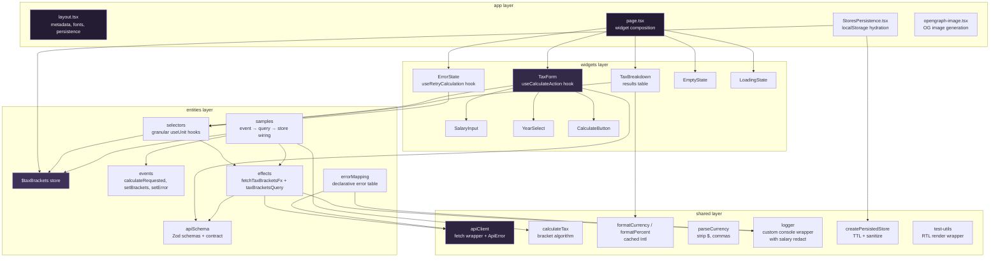
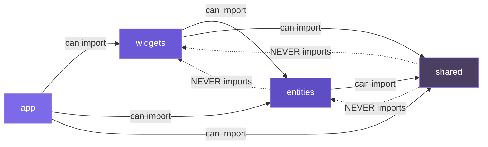

# FSD Architecture

## Layer Hierarchy

```mermaid
graph TB
    subgraph "app layer"
        A[layout.tsx<br/>metadata, fonts, persistence]
        B[page.tsx<br/>widget composition]
        C[StoresPersistence.tsx<br/>localStorage hydration]
        D[opengraph-image.tsx<br/>OG image generation]
    end

    subgraph "widgets layer"
        E[TaxForm<br/>useCalculateAction hook]
        F[TaxBreakdown<br/>results table]
        G[ErrorState<br/>useRetryCalculation hook]
        H[EmptyState]
        I[LoadingState]
        J[SalaryInput]
        K[YearSelect]
        L[CalculateButton]
    end

    subgraph "entities layer"
        M["$taxBrackets store"]
        N[events<br/>calculateRequested, setBrackets, setError]
        O[effects<br/>fetchTaxBracketsFx + taxBracketsQuery]
        P[samples<br/>event → query → store wiring]
        Q[selectors<br/>granular useUnit hooks]
        R[errorMapping<br/>declarative error table]
        S[apiSchema<br/>Zod schemas + contract]
    end

    subgraph "shared layer"
        T[apiClient<br/>fetch wrapper + ApiError]
        U[calculateTax<br/>bracket algorithm]
        V[formatCurrency / formatPercent<br/>cached Intl]
        W[parseCurrency<br/>strip $, commas]
        X[logger<br/>custom console wrapper<br/>with salary redact]
        Y[createPersistedStore<br/>TTL + sanitize]
        Z[test-utils<br/>RTL render wrapper]
    end

    B --> E & F & G & H & I
    E --> J & K & L
    E --> Q & S
    F --> Q & V
    G --> Q
    C --> M & Y

    Q --> M & O
    P --> O & N & M & U
    O --> T & S & X
    R --> T & X

    style A fill:#241C32,color:#F5F0FA
    style B fill:#241C32,color:#F5F0FA
    style E fill:#332A48,color:#F5F0FA
    style M fill:#3E3258,color:#F5F0FA
    style T fill:#2D243F,color:#F5F0FA
```

## Import Rules

```mermaid
graph LR
    APP[app] -->|can import| WIDGETS[widgets]
    WIDGETS -->|can import| ENTITIES[entities]
    ENTITIES -->|can import| SHARED[shared]
    APP -->|can import| ENTITIES
    APP -->|can import| SHARED
    WIDGETS -->|can import| SHARED

    SHARED -.->|NEVER imports| ENTITIES
    SHARED -.->|NEVER imports| WIDGETS
    ENTITIES -.->|NEVER imports| WIDGETS

    style APP fill:#7C6AE8,color:white
    style WIDGETS fill:#6B58D6,color:white
    style ENTITIES fill:#5E4DC4,color:white
    style SHARED fill:#4A3F63,color:white
```
