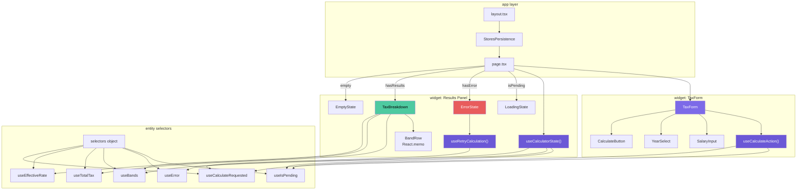
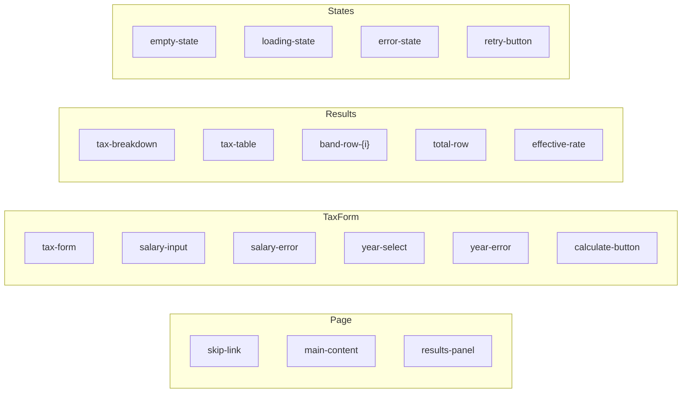

# Component Composition

## Widget → Sub-Component → Hook Tree

```mermaid
graph TD
    subgraph "app layer"
        Page[page.tsx]
        Layout[layout.tsx]
        Persist[StoresPersistence]
    end

    subgraph "widget: TaxForm"
        TF[TaxForm]
        SI[SalaryInput]
        YS[YearSelect]
        CB[CalculateButton]
        UCA["useCalculateAction()"]
    end

    subgraph "widget: Results Panel"
        TB[TaxBreakdown]
        BR[BandRow<br/>React.memo]
        ES[ErrorState]
        LS[LoadingState]
        EMS[EmptyState]
        UCS["useCalculatorState()"]
        URC["useRetryCalculation()"]
    end

    subgraph "entity selectors"
        SEL[selectors object]
        IP[useIsPending]
        UE[useError]
        UB[useBands]
        UT[useTotalTax]
        UER[useEffectiveRate]
        UCR[useCalculateRequested]
    end

    Layout --> Persist
    Persist --> Page
    Page --> TF
    Page --> UCS
    UCS --> IP & UE & UB

    TF --> UCA
    UCA --> UCR & IP
    TF --> SI & YS & CB

    Page -->|isPending| LS
    Page -->|hasError| ES
    Page -->|hasResults| TB
    Page -->|empty| EMS

    ES --> URC
    URC --> UCR

    TB --> BR
    TB --> UT & UER & UB

    SEL --> IP & UE & UB & UT & UER & UCR

    style TF fill:#7C6AE8,color:white
    style TB fill:#4ECAA0,color:black
    style ES fill:#E85C5C,color:white
    style UCA fill:#6B58D6,color:white
    style UCS fill:#6B58D6,color:white
    style URC fill:#6B58D6,color:white
```

## Data-testid Map

```mermaid
graph LR
    subgraph "Page"
        A["skip-link"]
        B["main-content"]
        C["results-panel"]
    end

    subgraph "TaxForm"
        D["tax-form"]
        E["salary-input"]
        F["salary-error"]
        G["year-select"]
        H["year-error"]
        I["calculate-button"]
    end

    subgraph "Results"
        J["tax-breakdown"]
        K["tax-table"]
        L["band-row-{i}"]
        M["total-row"]
        N["effective-rate"]
    end

    subgraph "States"
        O["empty-state"]
        P["loading-state"]
        Q["error-state"]
        R["retry-button"]
    end
```
