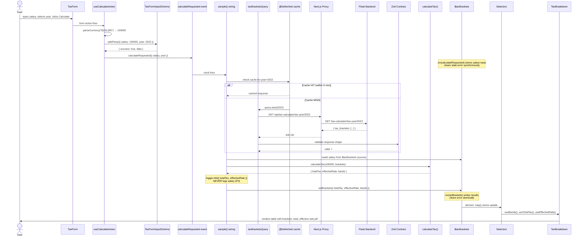
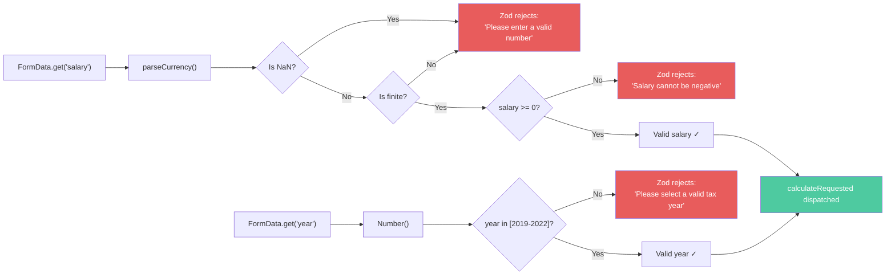

# Tax Calculation Data Flow

## Happy Path — Form Submit to Results

```mermaid
sequenceDiagram
    actor User
    participant TaxForm
    participant useCalculateAction
    participant Zod as TaxFormInputSchema
    participant Effector as calculateRequested event
    participant Sample as sample() wiring
    participant Query as taxBracketsQuery
    participant Cache as @farfetched cache
    participant Proxy as Next.js Proxy
    participant Flask as Flask Backend
    participant Contract as Zod Contract
    participant CalcTax as calculateTax()
    participant Store as $taxBrackets
    participant Selectors
    participant TaxBreakdown

    User->>TaxForm: types salary, selects year, clicks Calculate
    TaxForm->>useCalculateAction: form action fires
    useCalculateAction->>useCalculateAction: parseCurrency("$100,000") → 100000
    useCalculateAction->>Zod: safeParse({ salary: 100000, year: 2022 })
    Zod-->>useCalculateAction: { success: true, data }
    useCalculateAction->>Effector: calculateRequested({ salary, year })

    Note over Store: .on(calculateRequested) stores salary+year,<br/>clears stale error synchronously

    Effector->>Sample: clock fires
    Sample->>Cache: check cache for year=2022
    alt Cache HIT (within 5 min)
        Cache-->>Sample: cached response
    else Cache MISS
        Cache->>Query: query.start(2022)
        Query->>Proxy: GET /api/tax-calculator/tax-year/2022
        Proxy->>Flask: GET /tax-calculator/tax-year/2022
        Flask-->>Proxy: { tax_brackets: [...] }
        Proxy-->>Query: 200 OK
        Query->>Contract: validate response shape
        Contract-->>Query: valid ✓
    end

    Sample->>Store: reads salary from $taxBrackets (source)
    Sample->>CalcTax: calculateTax(100000, brackets)
    CalcTax-->>Sample: { totalTax, effectiveRate, bands }

    Note over Sample: logger.info({ totalTax, effectiveRate })<br/>NEVER logs salary (PII)

    Sample->>Store: setBrackets({ totalTax, effectiveRate, bands })

    Note over Store: .on(setBrackets) writes results,<br/>clears error atomically

    Store->>Selectors: derived .map() stores update
    Selectors->>TaxBreakdown: useBands(), useTotalTax(), useEffectiveRate()
    TaxBreakdown->>User: renders table with brackets, total, effective rate pill
```

## Form Validation Pipeline

```mermaid
flowchart LR
    A["FormData.get('salary')"] --> B["parseCurrency()"]
    B --> C{Is NaN?}
    C -->|Yes| D["Zod rejects:<br/>'Please enter a valid number'"]
    C -->|No| E{Is finite?}
    E -->|No| D
    E -->|Yes| F{"salary >= 0?"}
    F -->|No| G["Zod rejects:<br/>'Salary cannot be negative'"]
    F -->|Yes| H[Valid salary ✓]

    I["FormData.get('year')"] --> J["Number()"]
    J --> K{"year in [2019-2022]?"}
    K -->|No| L["Zod rejects:<br/>'Please select a valid tax year'"]
    K -->|Yes| M[Valid year ✓]

    H --> N[calculateRequested dispatched]
    M --> N

    style D fill:#E85C5C,color:white
    style G fill:#E85C5C,color:white
    style L fill:#E85C5C,color:white
    style N fill:#4ECAA0,color:white
```
