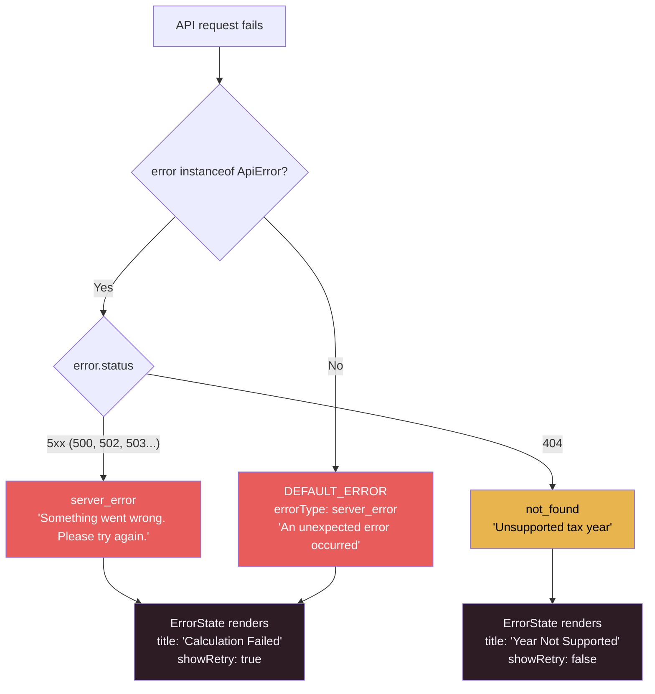
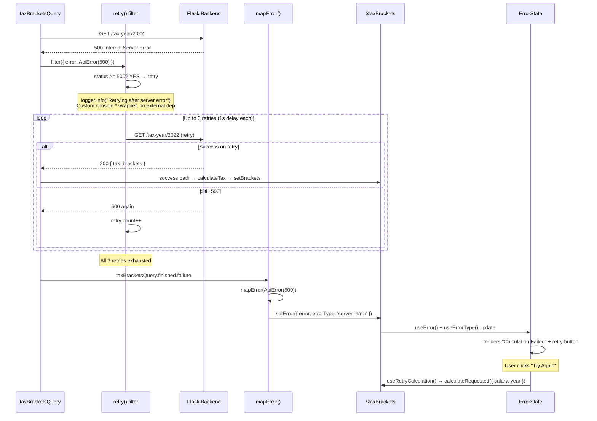

# Error Handling Flow

## 500 vs 404 Decision Tree

```mermaid
flowchart TD
    A[API request fails] --> B{error instanceof ApiError?}
    B -->|No| C[DEFAULT_ERROR<br/>errorType: server_error<br/>'An unexpected error occurred']
    B -->|Yes| D{error.status}

    D -->|"404"| E[not_found<br/>'Unsupported tax year']
    D -->|"5xx (500, 502, 503...)"| F[server_error<br/>'Something went wrong. Please try again.']

    E --> G[ErrorState renders<br/>title: 'Year Not Supported'<br/>showRetry: false]
    F --> H[ErrorState renders<br/>title: 'Calculation Failed'<br/>showRetry: true]
    C --> H

    style E fill:#E8B44E,color:black
    style F fill:#E85C5C,color:white
    style C fill:#E85C5C,color:white
    style G fill:#2E1C24,color:#F5F0FA
    style H fill:#2E1C24,color:#F5F0FA
```

## Retry Mechanism

```mermaid
sequenceDiagram
    participant Query as taxBracketsQuery
    participant Retry as retry() filter
    participant Flask as Flask Backend
    participant ErrorMap as mapError()
    participant Store as $taxBrackets
    participant UI as ErrorState

    Query->>Flask: GET /tax-year/2022
    Flask-->>Query: 500 Internal Server Error

    Query->>Retry: filter({ error: ApiError(500) })
    Retry->>Retry: status >= 500? YES → retry
    Note over Retry: logger.info("Retrying after server error")<br/>Custom console.* wrapper, no external dep

    loop Up to 3 retries (1s delay each)
        Retry->>Flask: GET /tax-year/2022 (retry)
        alt Success on retry
            Flask-->>Query: 200 { tax_brackets }
            Query->>Store: success path → calculateTax → setBrackets
        else Still 500
            Flask-->>Query: 500 again
            Retry->>Retry: retry count++
        end
    end

    Note over Retry: All 3 retries exhausted

    Query->>ErrorMap: taxBracketsQuery.finished.failure
    ErrorMap->>ErrorMap: mapError(ApiError(500))
    ErrorMap->>Store: setError({ error, errorType: 'server_error' })
    Store->>UI: useError() + useErrorType() update
    UI->>UI: renders "Calculation Failed" + retry button

    Note over UI: User clicks "Try Again"
    UI->>Store: useRetryCalculation() → calculateRequested({ salary, year })
```
