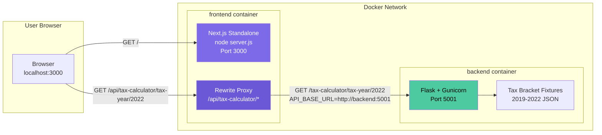
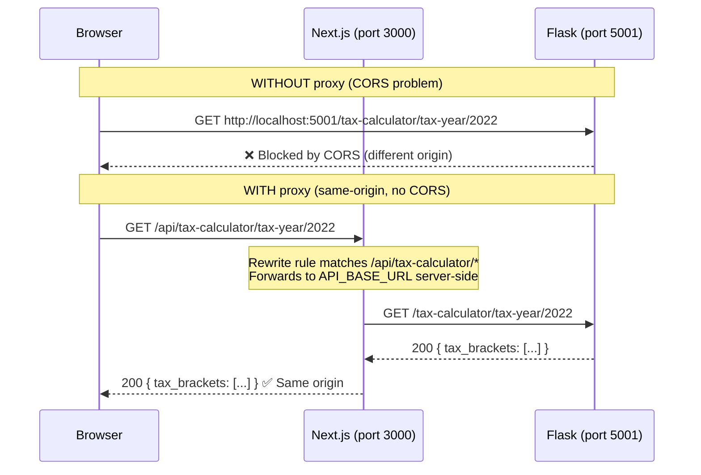

# Infrastructure

## Docker Compose Architecture

```mermaid
graph LR
    subgraph "User Browser"
        Browser["Browser<br/>localhost:3000"]
    end

    subgraph "Docker Network"
        subgraph "frontend container"
            Next["Next.js Standalone<br/>node server.js<br/>Port 3000"]
            Proxy["Rewrite Proxy<br/>/api/tax-calculator/*"]
        end

        subgraph "backend container"
            Flask["Flask + Gunicorn<br/>Port 5001"]
            Brackets["Tax Bracket Fixtures<br/>2019-2022 JSON"]
        end
    end

    Browser -->|"GET /"| Next
    Browser -->|"GET /api/tax-calculator/tax-year/2022"| Proxy
    Proxy -->|"GET /tax-calculator/tax-year/2022<br/>API_BASE_URL=http://backend:5001"| Flask
    Flask --> Brackets

    style Next fill:#7C6AE8,color:white
    style Flask fill:#4ECAA0,color:black
    style Proxy fill:#6B58D6,color:white
```

## Build Pipeline (3-Stage Dockerfile)

```mermaid
flowchart LR
    subgraph "Stage 1: deps"
        A["node:20-alpine"]
        B["COPY package*.json"]
        C["npm ci --ignore-scripts"]
    end

    subgraph "Stage 2: builder"
        D["COPY node_modules from deps"]
        E["COPY source code"]
        F["ARG API_BASE_URL=http://backend:5001"]
        G["npm run build<br/>(standalone output)"]
    end

    subgraph "Stage 3: runner (~250MB)"
        H["node:20-alpine"]
        I["adduser nextjs (uid 1001)"]
        J["COPY .next/standalone"]
        K["COPY .next/static"]
        L["COPY public/"]
        M["USER nextjs"]
        N["CMD node server.js"]
    end

    A --> B --> C
    C --> D --> E --> F --> G
    G --> H --> I --> J --> K --> L --> M --> N

    style A fill:#332A48,color:#F5F0FA
    style H fill:#4ECAA0,color:black
    style N fill:#7C6AE8,color:white
```

## Proxy: Why and How

```mermaid
sequenceDiagram
    participant Browser
    participant NextJS as Next.js (port 3000)
    participant Flask as Flask (port 5001)

    Note over Browser,Flask: WITHOUT proxy (CORS problem)
    Browser->>Flask: GET http://localhost:5001/tax-calculator/tax-year/2022
    Flask-->>Browser: ❌ Blocked by CORS (different origin)

    Note over Browser,Flask: WITH proxy (same-origin, no CORS)
    Browser->>NextJS: GET /api/tax-calculator/tax-year/2022
    Note over NextJS: Rewrite rule matches /api/tax-calculator/*<br/>Forwards to API_BASE_URL server-side
    NextJS->>Flask: GET /tax-calculator/tax-year/2022
    Flask-->>NextJS: 200 { tax_brackets: [...] }
    NextJS-->>Browser: 200 { tax_brackets: [...] } ✅ Same origin
```
