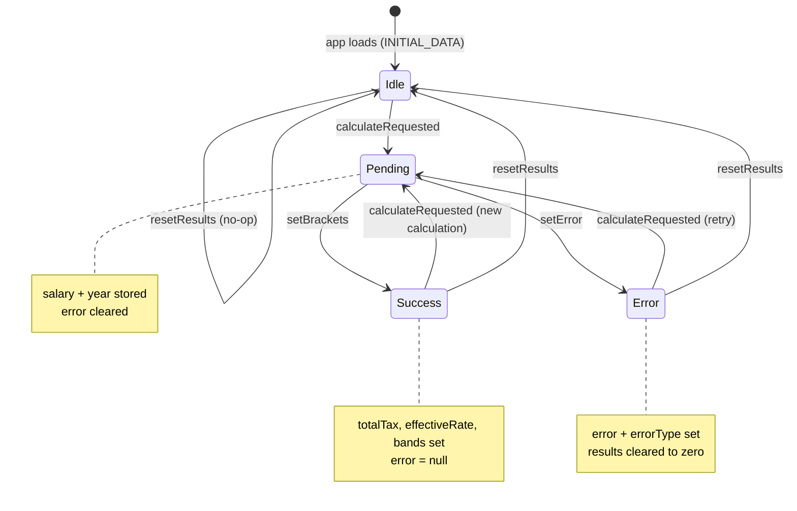
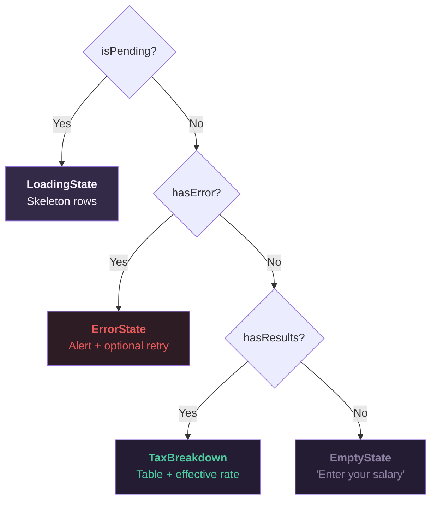
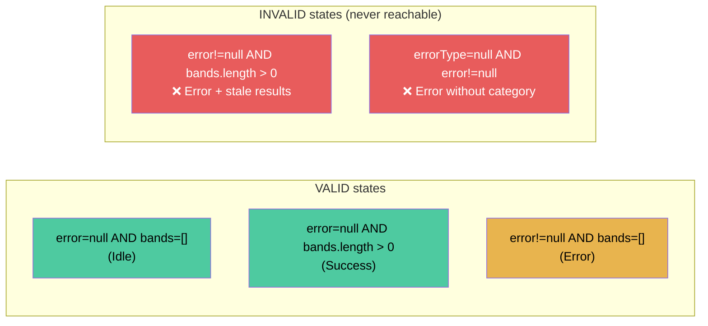

# Calculator State Machine

## Store State Transitions

```mermaid
stateDiagram-v2
    [*] --> Idle: app loads (INITIAL_DATA)

    Idle --> Pending: calculateRequested
    note right of Pending: salary + year stored<br/>error cleared

    Pending --> Success: setBrackets
    note right of Success: totalTax, effectiveRate, bands set<br/>error = null

    Pending --> Error: setError
    note right of Error: error + errorType set<br/>results cleared to zero

    Success --> Pending: calculateRequested (new calculation)
    Success --> Idle: resetResults

    Error --> Pending: calculateRequested (retry)
    Error --> Idle: resetResults

    Idle --> Idle: resetResults (no-op)
```

## Page Rendering Decision

```mermaid
flowchart TD
    A{isPending?} -->|Yes| B["<b>LoadingState</b><br/>Skeleton rows"]
    A -->|No| C{hasError?}
    C -->|Yes| D["<b>ErrorState</b><br/>Alert + optional retry"]
    C -->|No| E{hasResults?}
    E -->|Yes| F["<b>TaxBreakdown</b><br/>Table + effective rate"]
    E -->|No| G["<b>EmptyState</b><br/>'Enter your salary'"]

    style B fill:#332A48,color:#F5F0FA
    style D fill:#2E1C24,color:#E85C5C
    style F fill:#241C32,color:#4ECAA0
    style G fill:#241C32,color:#8A7FA0
```

## Store Invariants

These are enforced by `assertStateConsistency()` in tests:

```mermaid
flowchart LR
    subgraph "VALID states"
        V1["error=null AND bands=[]<br/>(Idle)"]
        V2["error=null AND bands.length > 0<br/>(Success)"]
        V3["error!=null AND bands=[]<br/>(Error)"]
    end

    subgraph "INVALID states (never reachable)"
        X1["error!=null AND bands.length > 0<br/>❌ Error + stale results"]
        X2["errorType=null AND error!=null<br/>❌ Error without category"]
    end

    style X1 fill:#E85C5C,color:white
    style X2 fill:#E85C5C,color:white
    style V1 fill:#4ECAA0,color:black
    style V2 fill:#4ECAA0,color:black
    style V3 fill:#E8B44E,color:black
```
