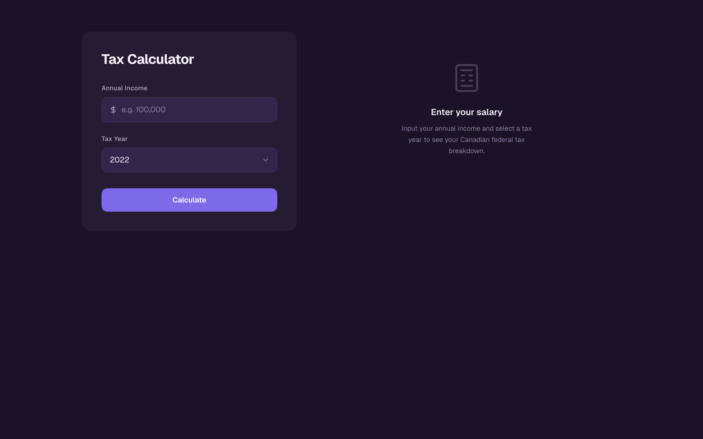
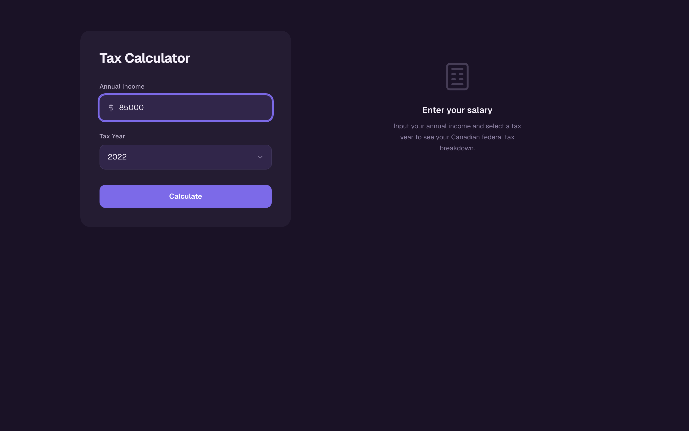
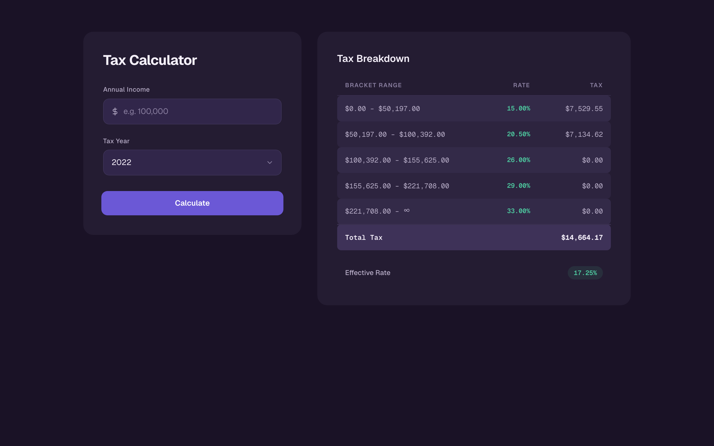
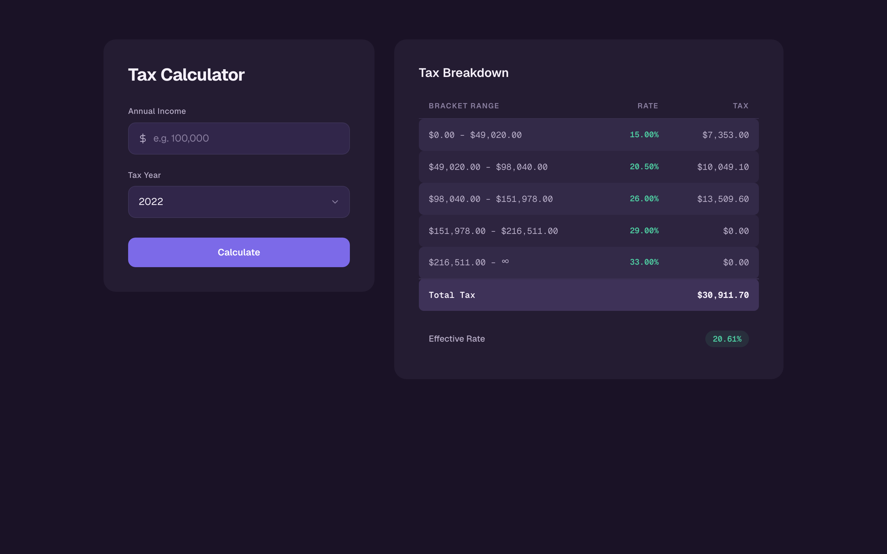
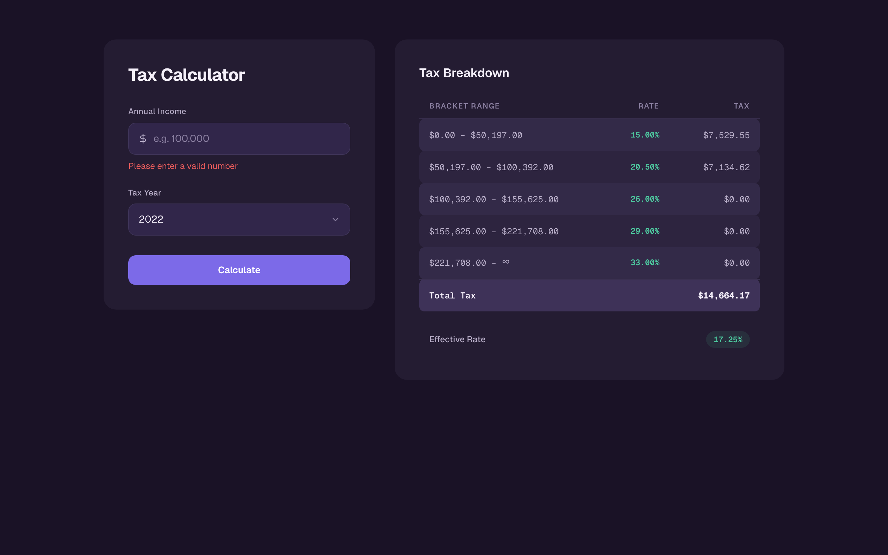

# Tax Calculator — Frontend

Canadian federal income tax calculator. Enter a salary and a tax year
(2019–2022), and the application fetches official bracket data from the backend,
computes per-bracket tax amounts, and displays an itemised breakdown alongside
the effective rate.

Built with Next.js 16 + React 19, state managed by Effector with @farfetched
queries, styled exclusively with Tailwind 4 design tokens, and organised
following Feature Sliced Design.

---

## Screenshots

| Initial state                                  | Form filled                                      |
| ---------------------------------------------- | ------------------------------------------------ |
|  |  |

| Results — $85,000 (2022)                      | Results — $150,000 (2021)                          |
| --------------------------------------------- | -------------------------------------------------- |
|  |  |

| Validation error                                           | Mobile viewport                                |
| ---------------------------------------------------------- | ---------------------------------------------- |
|  |  |

All screenshots live in [`../docs/media/`](../docs/media/) and are regenerated
by [`scripts/capture-media.mjs`](scripts/capture-media.mjs).

---

## Demo Video

A short walkthrough of the happy path and validation flow recorded against the
running Docker stack:

[`../docs/media/demo.webm`](../docs/media/demo.webm)

GitHub does not render `.webm` inline inside a README, so the link opens the
file in a new tab. Regenerate it with:

```bash
# From front-end/, with the Docker stack up on :3000
node scripts/capture-media.mjs
```

The script uses the standalone Playwright browser, walks through the widget, and
writes PNGs plus `demo.webm` to `../docs/media/`.

---

## Quick Start

### Option 1: Docker (recommended)

Runs the full stack — Flask backend on port 5001 and Next.js frontend on
port 3000.

```bash
# From the repo root (tax-calculator/)
docker compose up
```

Open `http://localhost:3000`.

### Option 2: Local dev

Requires Node.js 20+ and the Flask backend running separately on port 5001.

```bash
# From front-end/
npm install
npm run dev
```

Open `http://localhost:3000`. The dev server rewrites `/api/tax-calculator/*` to
`http://localhost:5001`.

### Option 3: Docker dev mode

Mounts source files into the container so hot reload works inside Docker.

```bash
# From the repo root (tax-calculator/)
docker compose -f docker-compose.yml -f docker-compose.dev.yml up
```

The `docker-compose.dev.yml` overlay sets the build target to `deps`, mounts
`./front-end` into `/app`, and overrides the container command to `npm run dev`.

---

## Documentation Index

| Document                                                                             | Description                                                                                                                                                                                                                 |
| ------------------------------------------------------------------------------------ | --------------------------------------------------------------------------------------------------------------------------------------------------------------------------------------------------------------------------- |
| [src/README.md](src/README.md)                                                       | FSD architecture overview — layers, import rules, layer boundaries                                                                                                                                                          |
| [src/app/README.md](src/app/README.md)                                               | App layer: layout, page, globals.css, OG image, store persistence                                                                                                                                                           |
| [src/shared/README.md](src/shared/README.md)                                         | Shared layer overview — API client, utilities, logger, types                                                                                                                                                                |
| [src/shared/api/README.md](src/shared/api/README.md)                                 | API client: fetch wrapper, ApiError class, usage                                                                                                                                                                            |
| [src/shared/lib/README.md](src/shared/lib/README.md)                                 | Library modules: tax algorithm, currency formatter, logger, persisted store, test utils                                                                                                                                     |
| [src/entities/README.md](src/entities/README.md)                                     | Entity layer overview — business domain models                                                                                                                                                                              |
| [src/entities/tax-brackets/README.md](src/entities/tax-brackets/README.md)           | Tax brackets entity: store, events, effects, samples, selectors, Zod schemas                                                                                                                                                |
| [src/widgets/README.md](src/widgets/README.md)                                       | Widget layer overview — composed UI components                                                                                                                                                                              |
| [src/widgets/tax-calculator/README.md](src/widgets/tax-calculator/README.md)         | Tax calculator widget: components, sub-components, hooks, constants                                                                                                                                                         |
| [src/widgets/tax-calculator/lib/README.md](src/widgets/tax-calculator/lib/README.md) | Custom hooks: useCalculateAction, useCalculatorState, useRetryCalculation                                                                                                                                                   |
| [e2e/README.md](e2e/README.md)                                                       | E2E testing guide: Page Object Models, specs, Gherkin/BDD feature files                                                                                                                                                     |
| [docs/ARCHITECTURE.md](docs/ARCHITECTURE.md)                                         | Full architecture deep dive: FSD layers, Effector model, data flow diagram, design decisions                                                                                                                                |
| [docs/ONBOARDING.md](docs/ONBOARDING.md)                                             | Step-by-step onboarding guide for new developers                                                                                                                                                                            |
| [docs/DESIGN-SYSTEM-GUIDE.md](docs/DESIGN-SYSTEM-GUIDE.md)                           | Design system reference: colour tokens, typography scale, spacing, component specs                                                                                                                                          |
| [docs/ROUTES.md](docs/ROUTES.md)                                                     | Routes, API proxy config, backend response schemas, data flow                                                                                                                                                               |
| [docs/IMPLEMENTATION-FINDINGS.md](docs/IMPLEMENTATION-FINDINGS.md)                   | Per-phase review findings and outcomes                                                                                                                                                                                      |
| [docs/IMPLEMENTATION-PLAN.md](docs/IMPLEMENTATION-PLAN.md)                           | Implementation plan and phase tracking                                                                                                                                                                                      |
| [docs/IMPLEMENTATION-JOURNAL.md](docs/IMPLEMENTATION-JOURNAL.md)                     | **Step-by-step journal** of the implementation, written as a swordsmith's scroll — formal technical log with bushido-style lessons. Read this to understand the order of operations and the reasoning behind each decision. |
| [docs/MEMORY-OF-AI.md](docs/MEMORY-OF-AI.md)                                         | **Diary of insights** kept by the AI who built the application, in the voice of a medieval Japanese apprentice. Companion to IMPLEMENTATION-JOURNAL — less formal, more reflective.                                         |
| [docs/ACCESSIBILITY.md](docs/ACCESSIBILITY.md)                                       | Accessibility features: WCAG criteria, screen reader support, ARIA patterns, testing                                                                                                                                        |
| [docs/FSD-GUIDE.md](docs/FSD-GUIDE.md)                                               | Feature Sliced Design: what it is, layers, import rules, how we use it                                                                                                                                                      |
| [../docs/diagrams/](../docs/diagrams/README.md)                                      | Mermaid diagrams: architecture, data flow, error flow, state machine, components, infrastructure (see the **Architecture Diagrams** section below for the full index)                                                       |

---

## Architecture Diagrams

Mermaid-based visualisations live under [`../docs/diagrams/`](../docs/diagrams/)
and render directly on GitHub, in VS Code with the Mermaid extension, or in any
Mermaid-compatible renderer.

| Diagram                                                 | Purpose                                                                                                                                                                                            |
| ------------------------------------------------------- | -------------------------------------------------------------------------------------------------------------------------------------------------------------------------------------------------- |
| [architecture.md](../docs/diagrams/architecture.md)     | Feature Sliced Design layer hierarchy (`app → widgets → entities → shared`) with the ESLint-enforced import rules                                                                                  |
| [data-flow.md](../docs/diagrams/data-flow.md)           | End-to-end sequence of a tax calculation: form submission → `useCalculateAction` → Effector event → `@farfetched` query → Flask backend → Zod contract → `calculateTax` → store update → UI render |
| [error-flow.md](../docs/diagrams/error-flow.md)         | Error handling decision tree — transient 500 responses hit the retry pipeline, while 404 / validation / network errors short-circuit straight to the error state                                   |
| [state-machine.md](../docs/diagrams/state-machine.md)   | Calculator widget state transitions between `empty`, `loading`, `results`, and `error`, with the events that drive each edge                                                                       |
| [component-tree.md](../docs/diagrams/component-tree.md) | Widget composition showing how `TaxCalculator`, `TaxForm`, `TaxBreakdown`, `EmptyState`, `LoadingState`, `ErrorState`, and the custom hooks fit together                                           |
| [infrastructure.md](../docs/diagrams/infrastructure.md) | Docker Compose topology, Next.js proxy rewrites, and the runtime boundary between the standalone Next server and the Flask backend                                                                 |

See [`../docs/diagrams/README.md`](../docs/diagrams/README.md) for the index
maintained alongside the diagrams themselves, and
[`../docs/ARCHITECTURE.md`](../docs/ARCHITECTURE.md) for the narrative that ties
them together.

---

## Tech Stack

| Package                                | Version | Role                                                                                                                                                                                                                                                                |
| -------------------------------------- | ------- | ------------------------------------------------------------------------------------------------------------------------------------------------------------------------------------------------------------------------------------------------------------------- |
| `next`                                 | 16.2    | App framework — App Router, API rewrites, standalone output                                                                                                                                                                                                         |
| `react` / `react-dom`                  | 19      | UI rendering, `useActionState` for forms                                                                                                                                                                                                                            |
| `effector` / `effector-react`          | 23      | Reactive state — stores, events, effects                                                                                                                                                                                                                            |
| `@farfetched/core` / `@farfetched/zod` | 0.14    | Query layer over effects: cache, retry, Zod contracts                                                                                                                                                                                                               |
| `zod`                                  | 3       | API response validation and form input validation                                                                                                                                                                                                                   |
| `tailwindcss`                          | 4       | CSS-first utility framework with design token integration                                                                                                                                                                                                           |
| _custom logger_                        | —       | 60-line structured logger in `src/shared/lib/logger/logger.ts` — `console.*` wrapper with salary redaction, Pino-shaped numeric levels. Replaced the `pino` dependency in Phase 8.6 to correct an architectural-honesty claim about dependency bundle contribution. |
| `clsx`                                 | 2       | Conditional className composition                                                                                                                                                                                                                                   |
| `effector-storage`                     | 7       | Persist Effector stores to localStorage                                                                                                                                                                                                                             |
| `@swc/jest`                            | —       | Fast Jest transform via SWC                                                                                                                                                                                                                                         |
| `@playwright/test`                     | 1.49    | Cross-browser E2E test runner                                                                                                                                                                                                                                       |
| `playwright-bdd`                       | 8.5     | Gherkin/BDD layer on top of Playwright                                                                                                                                                                                                                              |
| `@testing-library/react`               | 16      | Component testing utilities                                                                                                                                                                                                                                         |

---

## Scripts Reference

| Script                      | Description                                                              |
| --------------------------- | ------------------------------------------------------------------------ |
| `npm run dev`               | Start Next.js dev server with hot reload                                 |
| `npm run build`             | Production build (standalone output)                                     |
| `npm start`                 | Serve the production build                                               |
| `npm run lint`              | ESLint with import rules and FSD layer enforcement                       |
| `npm run lint:fix`          | ESLint with auto-fix                                                     |
| `npm run format`            | Prettier — format all JS/TS/MD files                                     |
| `npm run format:check`      | Prettier — check formatting without writing                              |
| `npm test`                  | Jest unit tests (serial, silent)                                         |
| `npm run test:local`        | Jest with 50% CPU parallelism — faster for local runs                    |
| `npm run test:ci`           | Jest with coverage output — used in CI                                   |
| `npm run test:coverage`     | Jest with coverage and open handle detection                             |
| `npm run test:e2e`          | Playwright E2E across all 4 browser projects                             |
| `npm run test:e2e:ui`       | Playwright interactive UI mode                                           |
| `npm run test:e2e:chromium` | Playwright — Chromium only (fastest)                                     |
| `npm run test:all`          | Jest + Playwright in sequence                                            |
| `npm run tsc:check`         | TypeScript type check (no emit, incremental)                             |
| `npm run tsc:watch`         | TypeScript watch mode                                                    |
| `npm run analyse:circular`  | Detect circular imports with dpdm                                        |
| `npm run analyse:deps`      | Detect unused/missing dependencies with depcheck                         |
| `npm run validate`          | Full local quality gate: format + lint:fix + tsc + circular + test:local |

---

## Testing

### Unit tests (Jest)

```bash
npm test                  # All unit tests, serial
npm run test:local        # Parallel, faster locally
npm run test:coverage     # With coverage report
```

Tests live alongside source files (`calculateTax.test.ts` next to
`calculateTax.ts`). Effector stores are tested with `fork()` and `allSettled()`
to isolate store state per test. The shared `renderWithScope` helper in
`src/shared/lib/test/test-utils.tsx` wires a forked scope into RTL renders.

### E2E tests (Playwright)

```bash
npm run test:e2e           # All browsers
npm run test:e2e:chromium  # Chromium only
npm run test:e2e:ui        # Interactive UI mode
```

E2E tests live in `e2e/`. Playwright spins up the full Docker stack
(`docker compose up --wait`) before running tests. Four browser projects are
configured: `chromium`, `firefox`, `webkit`, `mobile-chrome` (Pixel 5 viewport).

### BDD / Gherkin

`playwright-bdd` wraps Playwright with Gherkin feature files. Step definitions
map to Page Object Models in `e2e/pages/`. See [e2e/README.md](e2e/README.md)
for the full guide.

---

## Docker

### Production (full stack)

```bash
# From the repo root (tax-calculator/)
docker compose up
```

| Service    | Port | Notes                                                  |
| ---------- | ---- | ------------------------------------------------------ |
| `backend`  | 5001 | Flask API                                              |
| `frontend` | 3000 | Next.js standalone, `API_BASE_URL=http://backend:5001` |

The frontend container runs `node server.js` from the Next.js standalone output.
The image is built in three stages: `deps` (npm ci), `builder` (next build),
`runner` (minimal Alpine runtime, non-root user).

### Dev mode (hot reload in Docker)

```bash
# From the repo root (tax-calculator/)
docker compose -f docker-compose.yml -f docker-compose.dev.yml up
```

The dev overlay mounts the source tree into the container and runs
`npm run dev`, so edits on the host are reflected immediately without rebuilding
the image.

### Build the frontend image only

```bash
# From front-end/
docker build -t front-end:latest .
```

---

## Environment Variables

| Variable       | Default                 | Description                                                                                          |
| -------------- | ----------------------- | ---------------------------------------------------------------------------------------------------- |
| `API_BASE_URL` | `http://localhost:5001` | Base URL of the Flask backend. Used in `next.config.ts` to rewrite `/api/tax-calculator/*` requests. |

In Docker Compose, this is set to `http://backend:5001` (Docker service DNS).
For local development, leave unset to proxy to `localhost:5001`.

---

## Project Structure

```
front-end/
  src/
    app/            Next.js routing, layout, globals.css, OG image, store persistence
    widgets/        Feature-specific composed UI components
      tax-calculator/
    entities/       Business domain models (Effector stores, events, effects)
      tax-brackets/
    shared/         Reusable utilities, API client, custom structured logger, test helpers
      api/
      lib/
  e2e/              Playwright E2E tests — specs, Page Objects, Gherkin features
  docs/             Architecture, design system, onboarding, routes
  public/           Static assets
  Dockerfile        Three-stage build: deps → builder → runner
  next.config.ts    API rewrites, security headers, standalone output
  jest.config.ts    Unit test setup, path aliases, SWC transform
  playwright.config.ts  E2E config, browser projects, Docker web server
```

See [src/README.md](src/README.md) for the full FSD layer breakdown with import
rules.

---

## Contributing

### Code standards

- **SOLID**: Single responsibility per component and function. Dependency
  inversion via Effector events and stores — widgets never import entity
  internals directly.
- **DRY**: Shared utilities live in `#/shared/lib/`. No duplicate logic across
  widgets.
- **KISS**: Simplest solution that works. No premature abstractions.

### FSD import rules

Imports must only flow downward through the layers. A layer may import from
layers below it, never from layers above.

```
app  →  widgets  →  entities  →  shared
```

Breaking this rule is blocked at lint time by per-directory
`no-restricted-imports` overrides in `eslint.config.mjs` — one for each layer
boundary, covering both the `#/` alias form and the relative-path form. See
[src/README.md](src/README.md) for the full layer contract and the rule
definitions.

### Tailwind rules

- Use design token utilities: `bg-bg-card`, `text-text-primary`,
  `border-border-subtle`
- No `style={}`, no CSS modules, no `@utility` directive (removed in Tailwind 4)
- All theme configuration belongs in `src/app/globals.css` inside the
  `@theme inline` block
- No `tailwind.config.ts` — the project is CSS-first

See [docs/DESIGN-SYSTEM-GUIDE.md](docs/DESIGN-SYSTEM-GUIDE.md) for the full
token reference.

### Logging

Use the custom structured logger from `#/shared/lib/logger`. Never log salary
amounts (PII) — the logger's `redact` list replaces any field named `salary` at
the top level or one level nested with `'[Redacted]'` before emit. See
`src/shared/lib/logger/logger.ts`. Permitted: API calls, retry attempts, errors,
calculation results (total tax and effective rate only).

### Quality gate

Run this after every implementation phase before opening a PR:

```bash
npm run tsc:check && npm run lint && npm run analyse:circular && npm run test && npm run build && npm audit --audit-level=high
```

Or use the `validate` script for a faster local equivalent:

```bash
npm run validate
```
